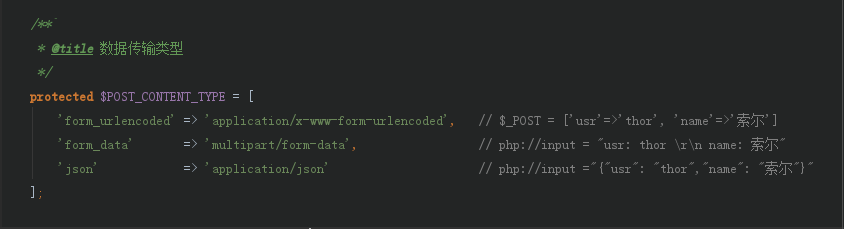

# 参数统一获取

参数统一获取是基于接口统一配置后衍生出来的，通过校验接口请求方式以及对每个参数的验证规则详细配置，
能很明确的知道通过什么方式去获取参数，没必要在控制器里每个获取，这节省了大量重复的代码

## 常见请求方式

- form_urlencoded：常见表单传递格式
- form_data：文件上传常用格式
- json：复杂参数常用格式

## 参数获取方法

 - 请求数据数组：$this->getSafeData();  (通用：get/post/put/delete，会过滤api.php未声明的字段)
 - 请求数据单条：$this->getSafeDataByKey($k, $def); (通用：get/post/put/delete，会过滤api.php未声明的字段)