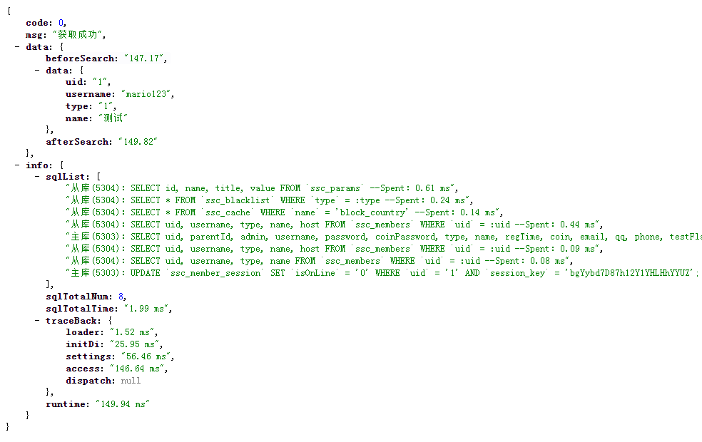

# 单元测试
---

## 为什么要单元测试

先问我们自己以下几个问题：

- 你的代码质量如何度量？
- 你是如何保证代码质量？
- 你敢随时重构代码吗？
- 你是如何确保重构的代码依然保持正确性？
- 你是否有足够信心在没有测试的情况下随时发布你的代码？

如果答案都比较犹豫，那么就证明我们非常需要单元测试。

它能带给我们很多保障：
- 代码质量持续有保障
- 重构正确性保障
- 增强自信心
- 自动化运行

## 编写前说明

单元测试对项目稳定性以及正确性的测试的作用不言而喻，
但目前并未使用相关断言框架，而是模拟请求调度、以及不同的条件去检查程序的正确性，
但前提是你的某个业务或者功能职责足够的单一，那需要你在开发前就意识到这一点，
控制器层支持模块分层，测试所有文件放在: /Controller/Test

## 已编写示例

- 模型所有操作测试： /Test/ModelController.php
- REDIS相关操作测试： /Test/RedisController.php
- 工具脚手架测试： /Test/UtilsController.php
- 浏览器识别测试： /Test/BrowserController.php
- 异常信息以及错误级别模拟： /Test/ErrorController.php

## 执行示例与结构

测试框架：MYSQL读写分离功能-测试链接：http://test10.6yc.com/wjapp/api.php?m=test&c=model&a=index&act=dbconn

