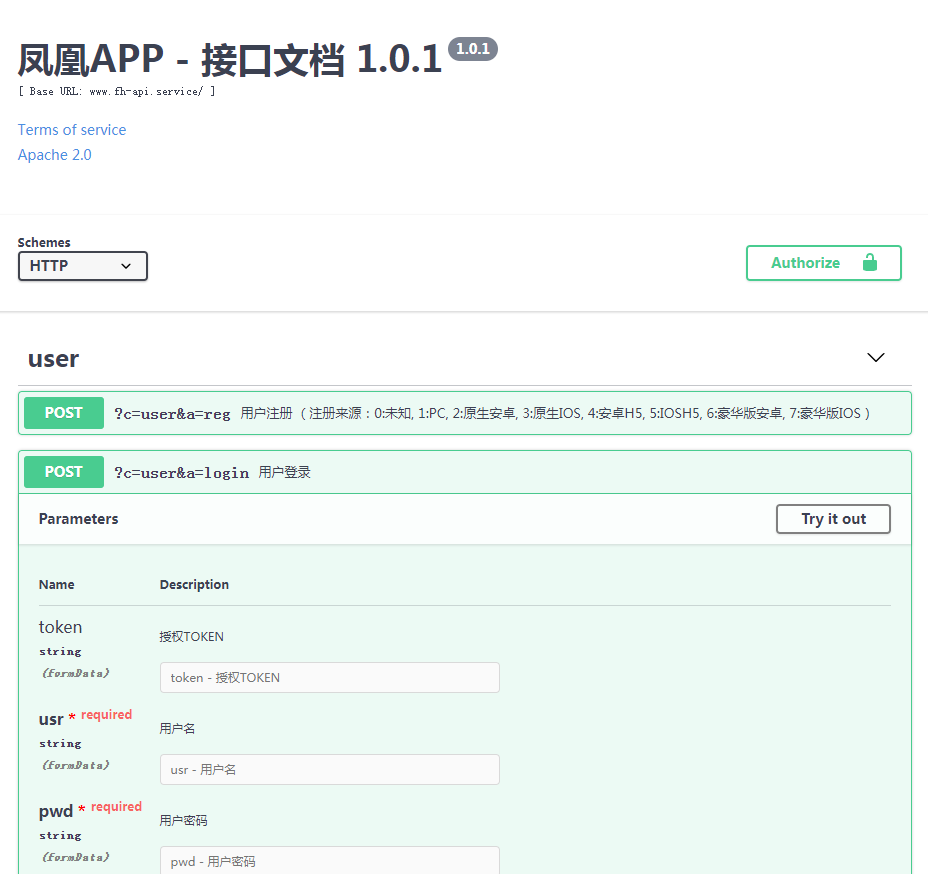

# 文档自动生成

---

文档请求说明基于 `swagger`, 页面基于JSON配置, 而服务器接口配置和 `swagger.json` 有很多相似之处,

 通过对`API接口配置`的转换 , 并`配置HTTP请求`, 让使用人员来`主动触发`，就完成了`文档自动生成`


## 文档生成

```
访问对应域名： host + /wjapp/api.php?m=test&c=test&a=apidoc，生成配置文件

```

## 文档导入

* 打开 swagger 在线编辑网页 (https://editor.swagger.io/)

* 导入文件：[FILE -> Import FILE -> FH-API-DOC.josn]


## 最终效果

---
