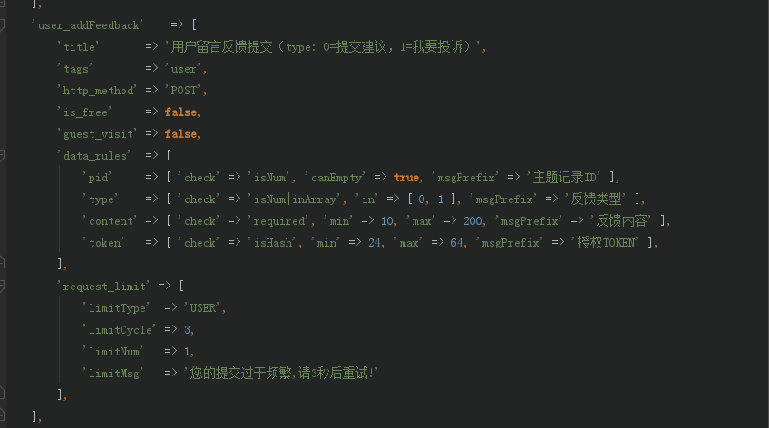

# 请求频率限制 （limiter）

接口限流算法目前主要是通过`计算用户访问频率间隔`来限制，实现思路是：给每个接口设置一个REDIS-hash数据, 
记录每个`限制对象`的上次访问时间, 以及计算每个限制对象的`平均访问间隔`，
如果这个`间隔周期内`再次访问，则提示用户访问频繁

## 限制对象

- `IP`：通过访问IP来限制，某个IP单位时间内能请求某个接口多少次，这会对某个公司或者团体IP有影响，
但可以通过加白名单的方式解决，不需要登录的接口目前只能使用此限流方式
- `USER`：通过登录用户来限制，要求必须是已登录用户，此限制方式如果是团队或者公司客户并不受影响

基于当前用户的体量，这两种限制方案已经能正常应对，当然后期会不断的完善限制算法，在用户体验以及系统保护之间找到平衡

## 配置说明

- 全局接口限制：配置在核心配置文件：`Config/app.php` 里，对所有接口生效，如果有单个接口限制则优先使用
    
- 单个接口限制：配置在接口配置文件：`Config/api.php` 里，会覆盖全局限制配置

```php
 * 请求限制参数（request_limit：根据周期和次数，算出每次请求间隔）
 * @tips   string  limitType         限制对象：IP: 访问IP, USER: 已登录用户
 * @tips   int     limitCycle        限制周期：每多少秒 （必填且>0）
 * @tips   int     limitNum          限制数量：支持访问多少次（必填且>0）
 * @tips   int     limitMsg          限制说明：访问频繁，请稍后重试 （默认、可自定义提示）
```

## 配置示例

留言反馈：限制登录用户、每3秒、只能请求1次，如果在限制间隔内请求，则提示对应文字，配置如下

