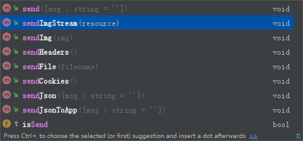

# 响应深度定制 (Response)

Response 是框架内置 - 请求级别的对象，它提供了大量响应相关的属性和方法供使用

## 内置方法
- 设置相关接口


- 输出相关接口



## 响应设置

- 响应头设置
```php
$this->setContentType('json');
$this->response->setHeader('Framework', 'FH-API');
$this->response->setHeader('X-Powered-By', 'FH-SERVICE');
```
- 响应数据主体设置
```php
$clientType = 'app';
if ( $clientType === self::CLIENT_TYPE_PC ) {
    $this->response->setData($data)->sendJson($msg);
} else {
    $this->response->setData($data)->sendJsonToApp($msg);
}
```

- 额外响应数据设置
```php
$this->response->setExtra('groups', \Api\Model\CoinLog::getGroups());
self::response()->setExtra('readTotal', count($readList));
```

- 响应运行信息设置
```php
$this->setInfo('traceBack', \Boot::$di['traceBack']);
$this->setInfo('runtime', Helper::runtime() . ' ms');
```

## 不同响应格式

- 响应TEXT：$this->response->send();
- 响应HTML：$this->response->sendHtml();
- 响应JSON：$this->response->sendJson();
- 响应PIC：$this->response->sendImg();
- 响应FILE：$this->response->sendFile();

## HTTP跨域配置
```php
# 跨域域名允许 | 允许跨域携带cookie -》 要求（Allow-Origin）不能为 * , 且必须指定单一域名
$this->setHeader('Access-Control-Allow-Origin', $this->_request->getScheme() . '://' . $origin);
# 跨域支持
$this->setHeader('Access-Control-Allow-Credentials', 'true');
# 跨域支持的请求方式：1:ajax - HttpMethod, 2: 普通 - HttpMethod
$this->setHeader('Access-Control-Allow-Headers', 'X-Requested-With,content-type');
# 请求支持的HttpMethod：OPTIONS为浏览器试探服务器存活请求，只响应 HttpCode:200 即可
$this->setHeader('Access-Control-Allow-Methods', 'PUT,POST,GET,DELETE,OPTIONS');
```

## 响应设置示例

```php
try {

    include API_PATH . 'Boot.php';
    (new Boot())->run();

} catch (ErrParams $e) {  # 参数错误
    ErrInfoHandler($e, 'ErrParams', $appConf);
    Boot::$di['response']->setErrCode(1)->sendJson($e->getMessage());
} catch (ErrSign $e) {    # 签名错误
    ErrInfoHandler($e, 'ErrSign', $appConf);
    Boot::$di['response']->setErrCode(1)->setHttpCode($e->getCode())->sendJson($e->getMessage());
} catch (ErrMsg $e) {     # 直接展示给用户的异常信息
    ErrInfoHandler($e, 'ErrMsg', $appConf);
    Boot::$di['response']->setErrCode(1)->sendJson($e->getMessage());
} catch (ErrHttp $e) {    # 带有http状态的异常信息：throw new ErrHttp('msg', 403)
    ErrInfoHandler($e, 'ErrHttp', $appConf);
    Boot::$di['response']->setErrCode(1)->setHttpCode($e->getCode())->sendJson($e->getMessage());
 }
```

## 响应JSON解析

默认响应JSON格式，以下是响应内容大致说明

```php
{
    "code": 0,               // 响应状态码：0：成功，1：失败
    "msg": "您已注册成功！",  // 响应提示信息
    "data": [],              // 响应数据主体（列表：json数组）（单条：json对象）
    "extra": {},             // 额外响应数据（json对象，必须带键名，键值可以是: 普通数据，json对象，json数组）
    "code|httPCode": 401,   // 未登录
    "code|httpCode": 403,   // 已登录、但没有权限访问
    "code|httpCode": 404,   // 访问资源不存在
    "code|httpCode": 500,   // 服务器异常
    "code|httpCode": 504,   // 服务器响应超时
  }
```