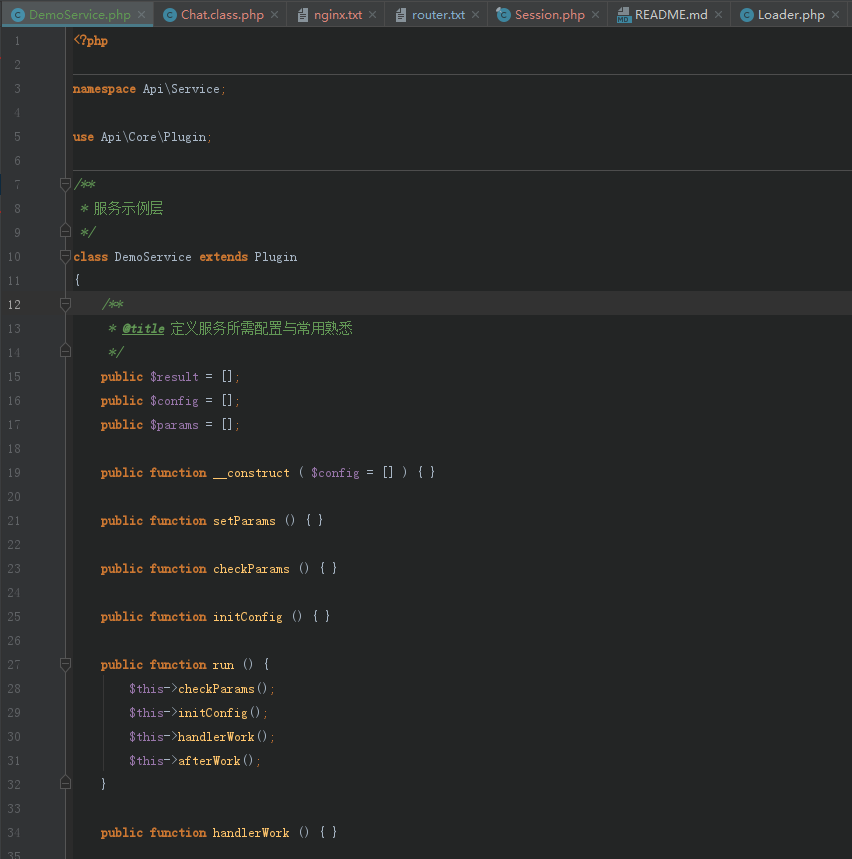

# 服务层 (service)

最开始的构想只是用来对复杂业务的抽象和封装，以此来保持控制器层以及模型层代码的整洁，

后面它承担了更多的职责，对某类业务的一个统一和梳理，如 `用户服务|支付服务|任务系统|报表服务`

让开发者能更清晰的归类以及书写他们的代码

## 使用场景

* 精简业务模型层：每个模型具体对应的是某个实体资源，只处理他们本身的增删改查即可
* 复杂业务抽象：如注册、登录、投注、支付，这些需要调度大量资源与行为的功能或业务的处理
* 系统业务分层：处于业务更上一层，对业务进行了整理和归类和梳理

## 定义服务

Service 文件必须放在 app/Service 目录，可以支持多级目录，访问通过自动加载目录名级联访问。

Service 层可以选择继承 全局插件：`Plugin`， 这样能方便的调度系统内置对象和方法

## 声明与使用
