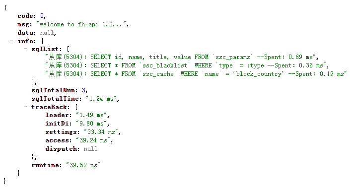

# SQL执行解析

---

框架对 `每一个请求内` 执行的 `所有SQL`内置了相关事件进行`记录和监听`，
记录了所有SQL执行列表、每条SQL执行的时间、以及总执行时间，
这不只在开发过程中帮助开发者进行功能调试，
也能在线上异常排查追溯中提供极大的方便。

## 细节解析

* 读写分离：主库：5301、从库：5304
* 执行语句：SELECT、INSERT、DELETE、UPDATE
* 花费时间：SQL - Spent: 0.36 ms
* 整体统计：
    - 执行语句列表：sqlList
    - 执行总SQL条数：sqlTotalNum
    - 执行总花费时间：sqlTotalTime

## 图片说明
