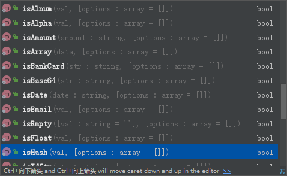
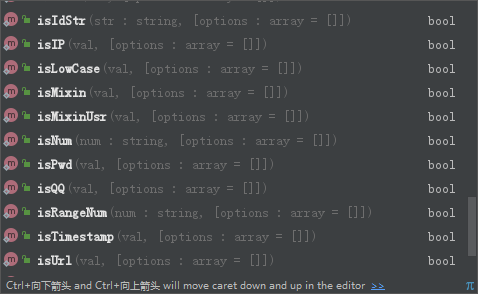
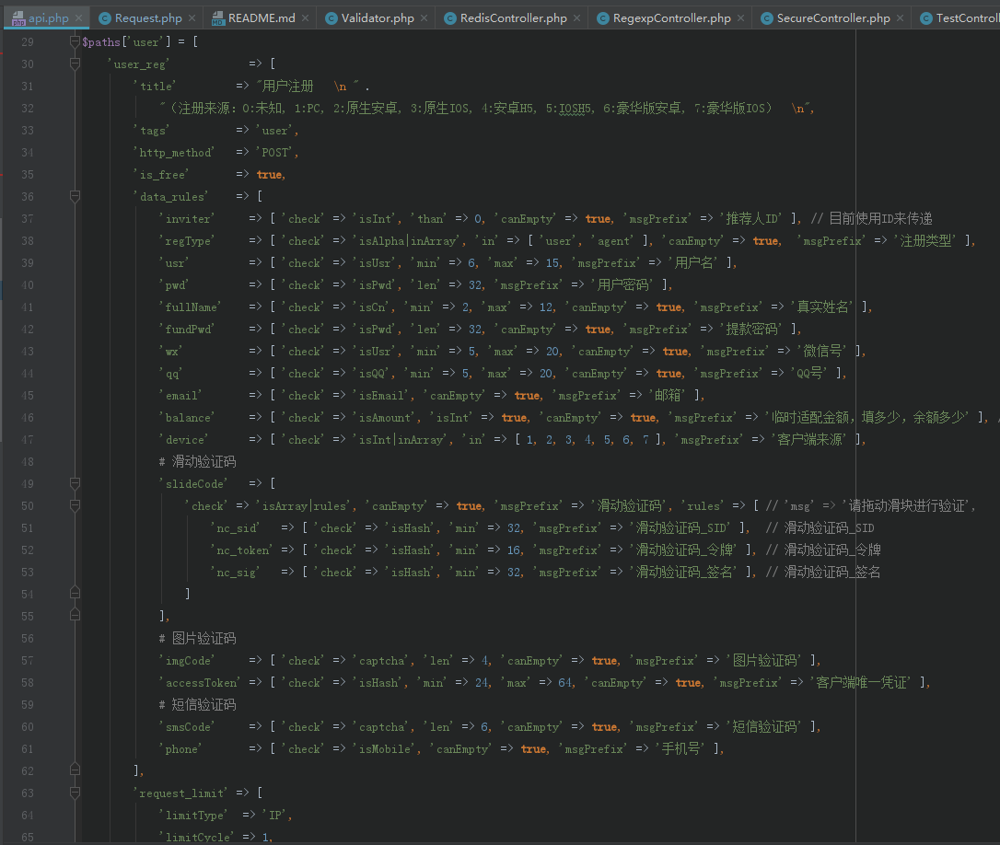

# 数据验证（Validator）
---

数据验证器是每个后端项目必备工具之一，通过对它不断的改进、完善、优化，
以及无数个项目的洗礼，现在终于可以说它是一款成熟的产品了。

## API有哪些

部分接口示例：

---





---

## 如何使用

- 单条数据验证
```php
if ( !Validator::isBase64($_COOKIE[$name]) ) {
    throw new ErrHttp('登录信息异常，请尝试退出后重新登录', 403);
}
```

- 数组|参数验证
```php
$rules = [
    'usr'    => [ 'check' => 'isUsr', 'min' => '6', 'max' => '20', 'msgPrefix' => '用户名' ],
    'pwd'    => [ 'check' => 'isPwd', 'len' => '32', 'msgPrefix' => '密码' ],
    'gen'    => [ 'check' => 'inArray', 'in' => [ '男', '女' ], 'msgPrefix' => '性别' ],
    'age'    => [ 'check' => 'isInt', 'min' => 18, 'max' => 100, 'canEmpty' => true, 'msgPrefix' => '性别' ],
    'amount' => [ 'check' => 'isAmount|notInArray', 'notIn' => [ 0 ], 'msgPrefix' => '交易金额' ],
];
if ( !Validator::validate($data, $rules) ) {
    throw new ErrMsg(Validator::getErrMsg());
}
```
- 数据内嵌数组验证
 - 如下配置示例：slideCode - 滑动验证码参数组

## 配置示例

以下是用户注册使用到的参数验证配置（可打开新页面查看）

